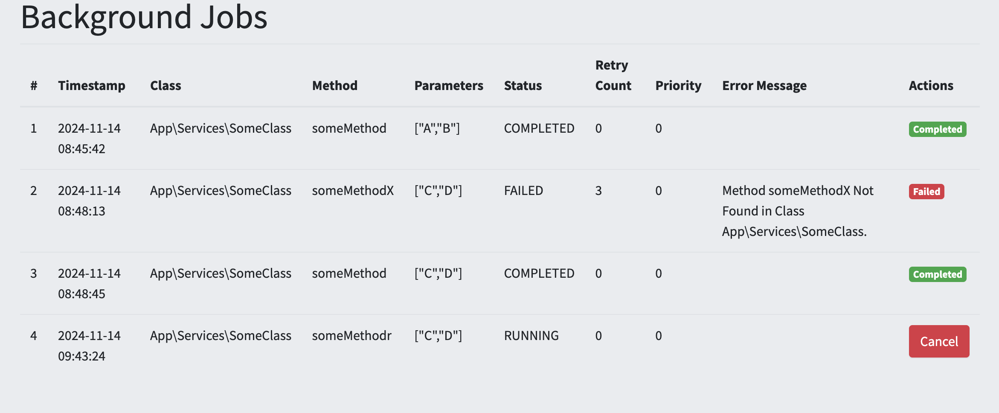
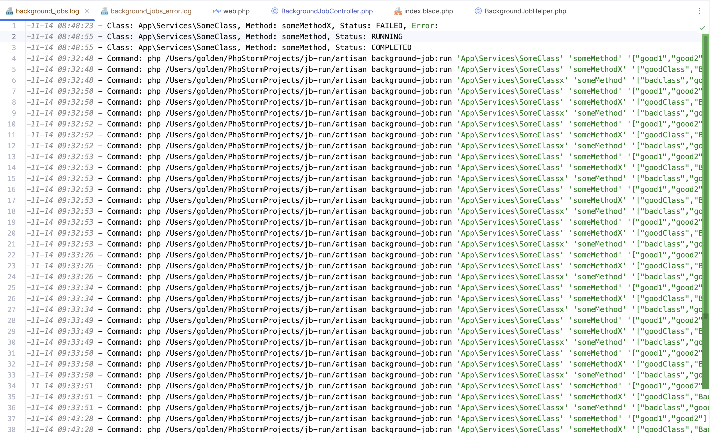
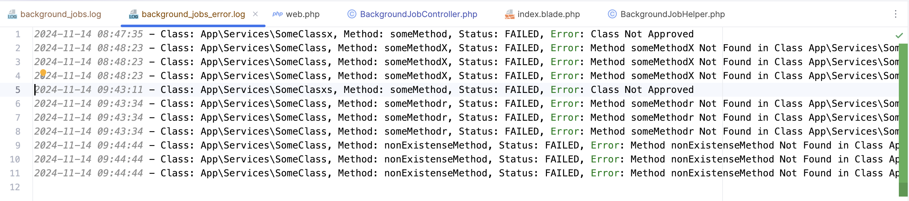

<p align="center">
  <a href="https://github.com/Chimsy/GoldenChimusindeIOS">
    
  </a>

<h3 align="center">Golden (Tapfuma) Chimusinde Technical Assessment</h3>

# Job Background System

This documentation provides a detailed explanation of how to use the `runBackgroundJob` function within a Laravel
application. The function allows you to run background tasks asynchronously with support for prioritization, delays,
retries, and logging.

## Table of Contents

1. [Overview](#overview)
2. [Technologies & Tools Used](#technologies--tools-used)
3. [Installation and Setup](#installation-and-setup)
    - [Initial Setup](#initial-setup)
4. [Usage](#usage)
    - [Running Background Jobs](#running-background-jobs)
    - [Configuring Retry Attempts](#configuring-retry-attempts)
    - [Configuring Delays](#configuring-delays)
    - [Setting Job Priorities](#setting-job-priorities)
5. [Examples](#examples)
    - [Running a Simple Job](#running-a-simple-job)
    - [Running a Job with Retry Attempts](#running-a-job-with-retry-attempts)
    - [Running a Job with Delay](#running-a-job-with-delay)
    - [Running a Job with Priority](#running-a-job-with-priority)
6. [License](#license)

## Overview

The `runBackgroundJob` function is part of a Laravel application that manages the execution of background tasks. This
system includes a database table to store job information, a model to interact with the table, and several classes to
handle job execution with features such as retries, delays, and prioritization.

## Technologies & Tools Used

- **Version Control:** Git, Fork(Git Client)
- **IDE:** PhpStorm, Visual Studio Code
- **Dev Environment:** Valet (PHP, NGINX), MariaDB, PHP 8.3.13, Composer, yarn, node
- **Laravel Flavour Used:** I used a version of Laravel that comes with AdminLTE admin Template within it. 
I maintained it upto Laravel 9, You Can Clone it here [LaravelAdminTemplate](https://github.com/Chimsy/LaravelAdminTemplate) 

## Installation and Setup

### Initial Setup

1. **Create a Database**: Create a database called: `jb-run` using any DBMS of your choice. For MySQL, run:

   ```bash
   mysql -u root -p
   ```

   Then execute:

   ```sql
   CREATE DATABASE `jb-run`;
   ```

2. **Copy `.env.example` to `.env`**:
   ```bash 
   cp .env.example .env
   ```

3. **Update `.env` File**:
   Add your database credentials and necessary system variables at the bottom of the `.env` file.

4. **Generate Application Key**:
   ```bash
   php artisan key:generate
   ```

5. **Install Dependencies**:
   ```bash
   composer update
   yarn install
   ```

6. **Set Up Laravel**:
   ```bash
   php artisan migrate:fresh --force --seed -v
   php artisan route:clear && php artisan config:clear && php artisan cache:clear && php artisan view:clear && composer dump-autoload
   ```
7. **Basic System Configuration**
   Take Note of the following to change the `MAX_RETRIES` and log file location of the `background_jobs` &
   `background_jobs_error`.
    ```dotenv
    # These Variables Are All Mine
    BACKGROUND_JOB_LOG_DIRECTORY="logs/background_jobs.log"
    BACKGROUND_JOB_ERROR_LOG_DIRECTORY="logs/background_jobs_error.log"
    MAX_RETRIES=3
    ```

## Usage

### Running Background Jobs

The `runBackgroundJob` function allows you to run any method in any class asynchronously. It takes the following
parameters:

- `className`: The fully qualified name of the class containing the method to run.
- `method`: The name of the method to execute.
- `params`: An array of parameters to pass to the method (optional).
- `priority`: An integer representing the priority of the job (optional, default is 0).
- `delay`: An integer representing the delay in seconds before the job starts (optional, default is 0).

### Configuring Retry Attempts

Retry attempts can be configured by specifying the number of retries in the Artisan command:

```bash
php artisan background-job:run {className} {method} {params} --retries=10
```

### Configuring Delays

Delays can be configured by specifying the delay in seconds in the Artisan command:

```bash
php artisan background-job:run {className} {method} {params} --delay=10
```

### Setting Job Priorities

Job priorities can be set when creating a job. Higher priority jobs run before lower-priority ones:

```php
BackgroundJobHelper::runBackgroundJob('App\Services\SomeClass', 'someMethod', ['param1', 'param2'], 5);
```

## Examples

### Running a Simple Job

```php
BackgroundJobHelper::runBackgroundJob('App\Services\SomeClass', 'someMethod', ['param1', 'param2']);
```

### Running a Job with Retry Attempts

```php
BackgroundJobHelper::runBackgroundJob('App\Services\SomeClass', 'someMethod', ['param1', 'param2'], 0, 0);
php artisan background-job:run 'App\Services\SomeClass' 'someMethod' '["param1", "param2"]' --retries=5
```

### Running a Job with Delay

```php
BackgroundJobHelper::runBackgroundJob('App\Services\SomeClass', 'someMethod', ['param1', 'param2'], 0, 10);
```

### Running a Job with Priority

```php
BackgroundJobHelper::runBackgroundJob('App\Services\SomeClass', 'someMethod', ['param1', 'param2'], 5);
```

## Screenshots

### Dashboard



### Background Jobs Log



### Background Jobs Log Errors



## License

This project is licensed under the MIT License. See the [LICENSE](LICENSE) file for details.
